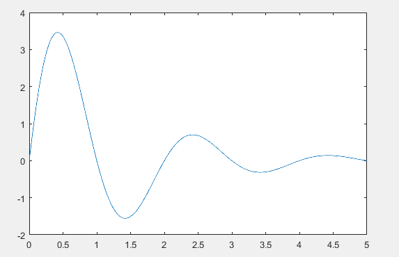
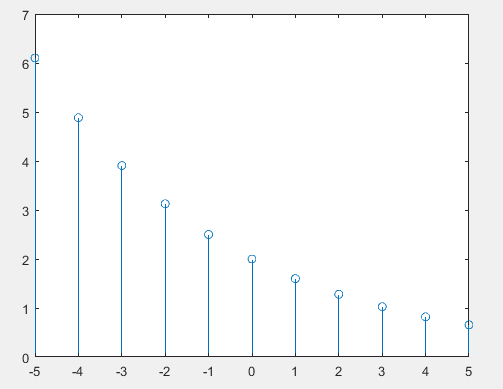
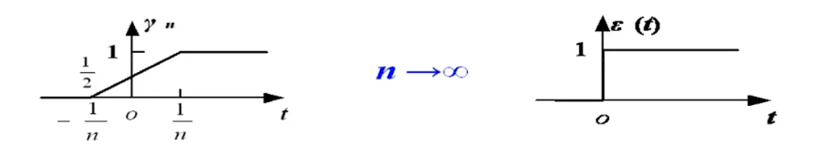
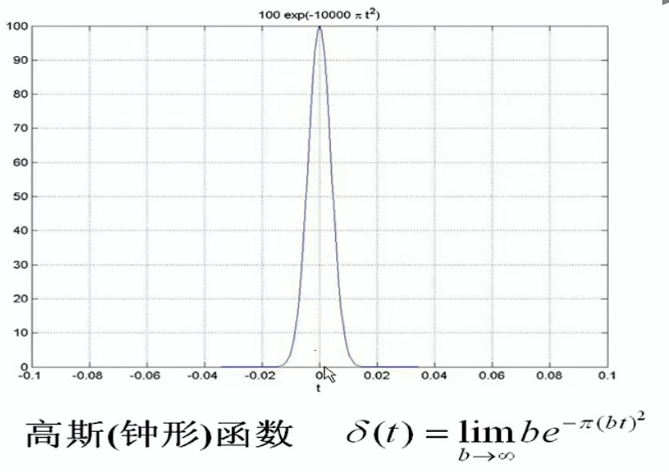
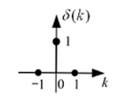
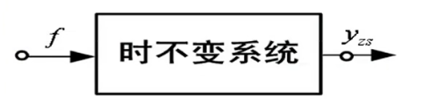

### 信号与系统

​	全书有三个关键问题：

- 基本信号及其响应
- 任意信号的分解
- LTI系统分析

#### 1.1 信号的基本概念和分类

##### 1.1.1 信号的分类

- 确定信号和随机信号
- 连续信号和离散信号
- 周期信号和非周期信号
- 能量信号和功率信号

##### 1.1.2 Matlab信号绘图

1. 连续信号 $f(t) = 5e^{-0.8t}\sin(\pi t) , 0 < t < 5$绘图。

```matlab
b = 5;
a = 0.8;
t = 0:0.001:5;
x = b*exp(-a*t).*sin(pi*t);
plot(t,x);
```

​	图片显示如下：



2. 离散信号 $f(k) = 2(0.8)^k , -5 < k <5$绘图

```matlab
c = 2;
d = 0.8;
k = -5:5;
y = c * d.^k; %注意“.^”
stem(k,y);
```

​	图片显示如下：



#### 1.2 基本信号

##### 1.2.1 阶跃函数

​	定义式：
$$
\varepsilon(t) = \lim_{n \to \infty} \gamma _n(t) 
= 
\left\{\begin{matrix}
  0 , t<0
\\1 , t>0
\end{matrix}\right.
$$
​	可以这样子定义：



##### 1.2.2 冲激函数

​	定义：对阶跃函数进行求导
$$
\left\{\begin{matrix}
  \delta (t) = 0, t\ne 0 \
  \\
\\\int_{-\infty }^{\infty }\delta (t)dt\ \ \ \ \ \ \ \
\end{matrix}\right.
$$
​	冲激函数的广义函数定义：
$$
\int_{-\infty }^{\infty }\delta (t)\varphi (t)dt = \varphi(0)
$$
​	满足上述关系的 $\delta (t)$ 都是冲激函数

​	例如：



##### 1.2.3 冲激函数的性质

- 冲激函数的取样性质： $f(t)\delta(t) = f(0)\delta(t)$  或  $\int_{-\infty }^{\infty }f(t)\delta(t)dt = f(0)$  ，积分区间内包含冲激所在的时刻。

- 冲激函数的导数$\delta'(t)$ ，也称为冲激偶： $f(t)\delta'(t) = f(t)\delta'(t) - f'(0)\delta(t)$  或 $\int_{-\infty }^{\infty }f'(t)\delta(t)dt = -f'(0)$
- 冲激函数尺度变换：$\delta(at) = \frac{1}{|a|}\delta(t)$
-  $\delta(t)$ 是偶函数，$\delta'(t)$ 是奇函数

##### 1.2.4 单位脉冲序列

​	单位脉冲序列定义如下：
$$
\delta(k) = 
\left\{\begin{matrix}
  1 , k = 0
\\0 , k \ne 0
\end{matrix}\right.
$$
​	如图所示：



​	取样性质：

- $f(k)\delta(k) = f(0)\delta(k)$
- $f(k)\delta(k-k_0) = f(0)\delta(k-k_0)$
- $\sum_{k = -\infty}^{\infty} f(k)\delta(k) = f(0) $

##### 1.2.5 单位阶跃序列

​	单位阶跃序列定义如下：

$$
\varepsilon (k) = 
\left\{\begin{matrix}
  1 , k \ge 0
\\0 , k < 0
\end{matrix}\right.
$$
​	$\varepsilon(k)$ 和 $\delta(k)$ 的关系：

- $\delta(k) = \varepsilon(k) -\varepsilon(k-1)$ 
- $\varepsilon(k) = \sum_{i = -\infty}^{k} \delta(i)$

#### 1.3 信号运算

- $f_1(t)$ 和 $f_2(t) $ 的加减乘指同一时刻两信号之值对应加减。
- 反转： $f(t)$ 和 $f(-t) $ 
- 右移： $f(t) \to f(t-t_0) $ 
- 左移： $f(t) \to f(t+t_0) $ 
- 尺度变换： $f(t) \to f(at) $ 

#### 1.4 系统的概念及分类

 - 系统的定义：指若干互相关联的事物组合而成具有特定功能的整体。
 - 系统的作用：对输入信号进行加工和处理，将其转换为所需要的输出信号
 - 系统的分类：线性系统和非线性系统
 - 系统的分类：动态系统和即时系统
 - 系统的分类：时变系统和时不变系统
 - 系统的分类：因果系统和非因果系统

##### 1.4.1 线性系统

​	线性系统是指满足线性性质的系统：

- 齐次性：$af_1 \to ay_1 \\ f_2 \to y_2$ 
- 可加性：$f_1 + f_2 \to y_1 + y_2$
- 线性： $af_1 + bf_2 \to ay_1 + by_2$

##### 1.4.2 动态系统

​	**动态系统的响应**不仅与激励 $f(\cdot)$ 有关，而且与他过去的状态 $x(0)$ 有关，也称为记忆系统。含有记忆元件，如电容、电容等的系统是动态系统，否则称即时系统或无记忆系统。

- 完全响应：$y(\cdot) = T[\left \{ f(\cdot) \right \}, \left \{ x(\cdot) \right \}] $
- 零状态响应：$y(\cdot) = T[\left \{ f(\cdot) \right \}, \left \{ 0 \right \}] $
- 零输入响应：$y(\cdot) = T[\left \{0\right \}, \left \{ x(\cdot)  \right \}] $

​	当动态系统满足下列三个条件时，该系统为线性系统：

1. 可分解性 ：$y(\cdot) =  y_{zx}(\cdot) + y_{zi}(\cdot)$
2. 零状态线性：$T[\left \{ af_1(t) + bf_2(t) \right \}, \left \{ 0 \right \}] = aT[\left \{ f_1(t)  \right \}, \left \{ 0 \right \}] +bT[\left \{ f_2(t)  \right \}, \left \{ 0 \right \}]$ 
3. 零输入线性：$T[\left \{ 0 \right \}, \left \{ ax_1(0) + bx_2(0) \right \}] = aT[\left \{ 0  \right \}, \left \{ x_1(0) \right \}] +bT[\left \{ 0  \right \}, \left \{ x_2(0) \right \}]$ 

##### 1.4.3 时不变系统

​	时不变系统的定义：系统输入延迟多少时间，其零状态响应也相应延迟多少时间。



​	时不变性： $f(t-t_d) \to y_{zs}(t-t_d)$

##### 1.4.4 因果系统

​	因果系统的定义：是指零状态响应不会出现在激励之前的系统。
