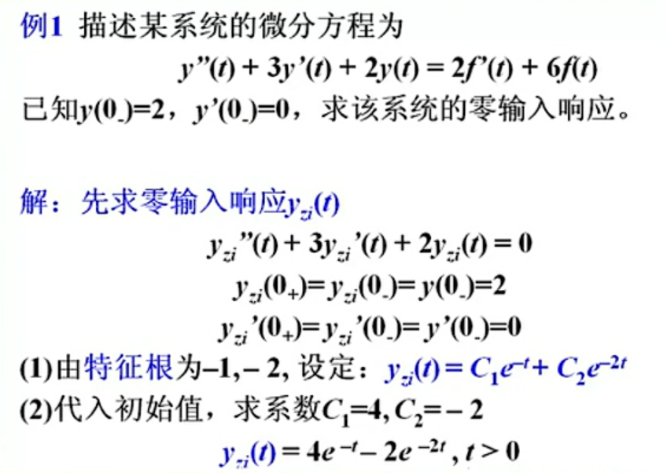
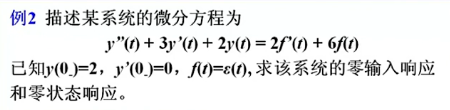
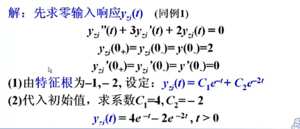
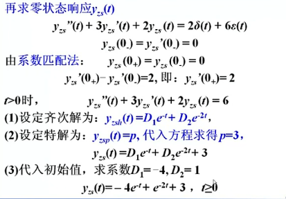
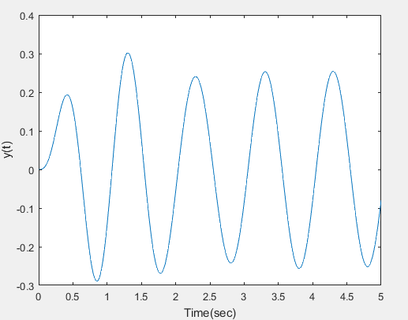
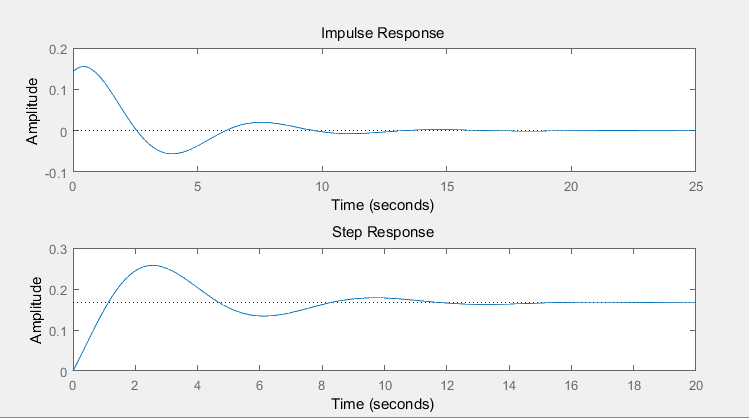
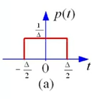
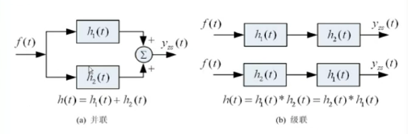
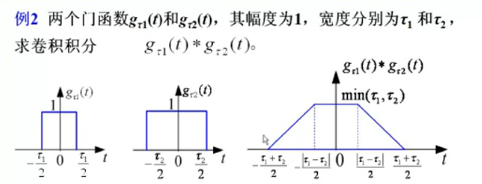
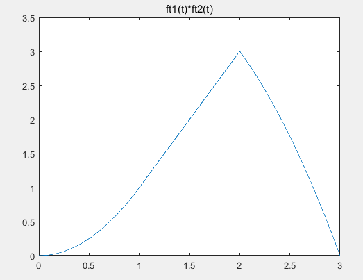

### 连续系统的时域分析

#### 2.1 LIT连续系统的分析

##### 2.1.1 微分方程的经典解法

​	对于微分方程：
$$
y^{n}(t) + a_{n-1}y^{n-1}(t)...+a_1y^{(1)}+a_0y(t)
\\
= b_mf^{(m)}(t) + b_{m-1}f^{(m-1)}(t)+...+b_1f^{(1)}(t)+b_0f(t)
$$
​	其解如下：
$$
y(t) = y_h(t) + y_p(t)
$$
​	**齐次解**：对应齐次微分方程的解
$$
y^{n}(t) + a_{n-1}y^{n-1}(t)...+a_1y^{(1)}+a_0y(t) = 0
$$

1. 对应的特征根为：

$$
\lambda^{n} + a_{n-1}\lambda^{n-1}...+a_1\lambda+a_0 = 0
$$

​		解的对应的根：
$$
\lambda_i (i = 1,2,3...,n)
$$

2. 根据特征根得到齐次解的函数形式

|               特征根$\lambda$                |                  齐次解$y_n(t)$                  |
| :------------------------------------------: | :----------------------------------------------: |
|                    单实根                    |                 $Ce^{\lambda t}$                 |
|                   二重实根                   |           $(C_1t + C_0)e^{\lambda t}$            |
| 共轭复根 $\lambda_{1,2}= \alpha \pm j\beta $ | $[C\cos(\beta t) + D\sin(\beta t)]e^{\lambda t}$ |


​	**特解**：原方程的解

​	不同激励对应的特解：

|                激励$f(t)$                |                         特解$y_p(t)$                         |
| :--------------------------------------: | :----------------------------------------------------------: |
|                   $t$                    | $P_1t + P_0  \quad 所有特征根均不等于0 \\ t \cdot(P_1t + P_0) \quad 有1个等于0的特征根 $ |
|              $e^{\alpha t}$              | $ Pe^{\alpha t} \quad \alpha 不等于特征根 \\  (P_1t+P_0 )e^{\alpha t} \quad \alpha 等于特征根$ |
| $\cos{(\beta t)} \ or \ \sin{(\beta t)}$ | $P \cos(\beta t) + Q\sin(\beta t) \quad 所有的特征根均不低于 \pm j \beta$ |

##### 2.1.2 系统的初始值

​	**初始值**是n阶系统在 t = 0 时接入激励，其响应在 $ t = 0_+$时刻的值，即：
$$
y^{(j)}(0_+)(j = 0,1,2...,n-1)
$$
​	**初始状态**是指系统在激励尚未接入的$t = 0_-$ 时刻的响应值 $y^{(j)}(0_-)$ ，该值反应了系统的历史情况，而与激励无关。

​	为求解微分方程，需要从已知的初始状态 $y^{(j)}(0_-)$ ，求得 $y^{(j)}(0_+)$

​	Tips：微分方程等号右端含有 $\delta(t)$ 时，仅在等号左端 $y(t)$ 的最高阶导数中含有 $\delta(t)$ ，则 $y(t)$ 的次高阶跃变，其余连续。若右端不含冲激函数，则不会有跃变。

##### 2.1.3 零输入响应

​	系统响应表达式如下：
$$
y(t) = y_{zi}(t) + y_{zs}(t)
$$

1. 初始值的确定：$ y_{zi}(t)$ 对应齐次微分方程，故不存在跃变，即：

$$
y_{zi}^{(j)}(0_+) = y_{zi}^{(j)}(0_-) = y^{(j)}(0_+)
$$

2. 求解步骤：
    	1. 设定齐次解
     2. 带入初始值，求待定系数

  例题如下：



##### 2.1.3 零状态响应

1. 初始值的确定：

$$
y_{zs}^{(j)}(0_-) =0,j=0,1,2,...n-1
$$


2. 由系统匹配法，从 $y_{zs}^{(j)}(0_-)$ 求  $y_{zs}^{(j)}(0_+)$ ；
3. 先求  $y_{zi}^{(j)}(0_+)$ ，再求 $y_{zs}^{(j)}(0_+) = y^{(j)}(0_+) - y_{zi}^{(j)}(0_+)$ 
4. 设定齐次解
5. 设定特解，代入方程求解
6. 带入初始值，求待定系数

例题如下



​	零输入响应：



​	零状态响应：



##### 2.1.4 响应的分类

- 固有响应 和 强迫响应
- 暂态响应 和 稳态响应

#### 2.2 冲激响应

​	冲激响应定义：是由单位冲激函数 $\delta(t)$ 所引起的零状态响应，记为 $h(t)$

​	其中：

- $ f(t) = \delta(t) $
- $h(0_-) = h'(0_-) = 0$

​	对于二阶LTI系统的微分方程：
$$
y''(t) + a_1y'(t) + a_0y(t) = b_2f''(t) + b_1f'(t) + b_0f(t)
$$
​	求解系统的冲激响应：

1. 选取新变量 $ h_1(t) $ ，使它满足：

$$
h_1''(t) + a_1h'(t) + a_0h_1(t) = \delta(t)
\\
h_1(0_-) = h_1'(0_-) = 0
$$

2. 用经典法解 $ h_1(t) $ 
3. 根据LTI系统零状态响应的线性性质和微分特性，则冲激响应：

$$
h(t) = b_2h_1''(t) + b_1h_1''(t) + b_0h_1(t)
$$

#### 2.3 Matlab求解

##### 2.3.1 零状态响应

​	求LTI系统的零状态响应的函数是lsim，其调用格式为：

```matlab
y = lsim(sys,f,t)
```

​	其中：

- t 表示抽样点向量

- f 是系统输入信号

- sys是LTI系统模型，用来表示微分方程

​	系统模型 sys 要借助 tf 函数获得，其调用方式为：

```matlab
sys = tf(b,a)
```

​	其中：

- a 表示左端各项的系数

- b 表示右端各项的系数

​	例如：

$$
y''(t) + 5y'(t) + 6y(t) = f'(t) + 2f(t)
$$
​	代码如下：

```matlab
a = [1,5,6];
b = [1,0,2];
sys = tf(b ,a);
```

​	例：系统微分方程为：
$$
y''(t) + 2y'(t) + 77y(t) = f(t)
$$
​		在 $ t \ge 0$ 接入激励 $f(t) = 10\sin(2\pi t)$ ，求零状态响应

​	代码如下：

```matlab
sys = tf([1],[1 2 77]);
t = 0:0.01:5;
f = 10 * sin(2*pi*t);
y = lsim(sys,f,t);
plot(t,y);
xlabel('Time(sec)');
ylabel('y(t)')
```

​	响应如下：



##### 2.3.2 冲激响应

​	Matlab提供了专门用于求LTI系统的冲激响应和阶跃响应的函数。设LTI系统的微分方程为：
$$
\sum^n_{i=1} a_iy^{(i)}(t) = \sum^m_{j=1}b_if^{(i)}(t)
$$
​	求LTI系统的冲激响应的函数为：

```matlab
impulse(b,a);
```

​	求LTI系统的阶跃响应的函数为：

```matlab
step(b,a);
```

​	例如：求以下系统的冲激响应和阶跃响应
$$
7y''(t) + 4y'(t) + 6y(t) =f'(t) + (t)
$$
​	代码如下：

```matlab
a = [7 4 6];
b = [1 1];
subplot(2,1,1)
impulse(b,a);
subplot(2,1,2)
step(b,a);
```

​	结果如下：



#### 2.4 卷积积分

##### 2.4.1 信号的时域分解

- 门函数：$ p(t) $



​	面积为：1

##### 2.4.2 卷积公式

​	已知在 $(-\infty,\infty)$ 上的两个函数 $f_1(t)$ 和  $f_2(t)$ ，则定义积分：
$$
f(t) = \int_{-\infty}^{\infty}f_1(\tau)f_2(t-\tau)d\tau
$$
​	为 $f_1(t)$ 与  $f_2(t)$ 的卷积积分，简称卷积，记为：
$$
f(t) = f_1(t) * f_2(t)
$$
​	注意：积分是在虚设的变量 $\tau$ 下进行的，$\tau$ 为积分变量，t 为参变量。结果仍为 t 的函数。可演变其他上下限。

##### 2.4.3 卷积积分的代数性质

- 满足交换律、分配律和结合律
- 复合系统的冲激响应：



##### 2.4.4 奇异函数的卷积特性

- $f(t) * \delta(t) = f(t)  \to f(t) * \delta(t-t_0) = f(t- t_0)$
- $f(t) * \delta'(t) = f'(t)$

##### 2.4.5 卷积的微积分性质

$$
1. \quad\frac{d^n}{dt^n}[f_1(t)*f_2(t)]
= \frac{d^nf_1(t)}{dt^n} * f_2(t) 
= f_1(t) * \frac{d^nf_2(t)}{dt^n}
$$

$$
2. \quad\int^t_{-\infty}[f_1(\tau)*f_2(\tau)]d\tau 
=[\int^t_{-\infty}f_1(\tau)d\tau ]*f_2(\tau)
=f_1(\tau)*[\int^t_{-\infty}f_2(\tau)d\tau ]
$$

$$
3. \quad f_1(t) * f_2(t) = f_1'(t) * f_2^{(-1)}(t)

\\
\\

条件：f'(-\infty) = 0 \quad or \quad f_2^{-1}(+\infty) = 0
$$

##### 2.4.6 卷积的时移特性

​	若有：
$$
f(t) = f_1(t) * f_2(t)
$$
​	根据时移性质，有：
$$
f_1(t-t_1) * f_2(t-t_2) = f(t-t_1-t_2)
$$

##### 2.4.7 用梳状函数卷积产生周期函数

​	周期为T的周期冲激函数序列，常称为**梳状函数**
$$
\delta_T(t) = \sum^{\infty}_{m = -\infty} \delta(t-mT)
$$

	- 卷积结果仍然是 周期函数， 其周期为 T
	- 当 T > $\tau$ 时，$f_T(t)$ 中的每个周期内的波形与 $f(t)$ 相同
	- 当 T < $\tau$ 时，各相邻脉冲之间将会出现重叠，将无法使波形 $f(t)$ 在 $f_T(t)$ 的每个周期中重现

 ##### 2.4.8 矩形脉冲的卷积产生三角形和梯形脉冲

​	例如：



​	两个不同宽的门函数卷积时，其结果为梯形函数，梯形函数的高度为**窄门**的门宽（面积），其上底为两个门函数宽度之差的绝对值，下底为两个门函数宽度之和。

##### 2.4.9 Matlab的卷积求解

​	Matlab 处理离散卷积的函数为：

```matlab
conv(f1,f2);
```

​	对序列做卷积运算。

​	处理连续信号的卷积时，需要对连续信号取相同的卷积步长，结果再乘以实际步长。

​	例：已知两个连续时间信号为如下
$$
f_1(t) = \left\{\begin{matrix}
  2, 0 <t<1
\\0, else \quad \quad
\end{matrix}\right.
\\
\\
f_2(t) = \left\{\begin{matrix}
  t, 0 <t<1
\\0, else \quad \quad
\end{matrix}\right.
$$
​	利用matlab画出$f_1(t) * f_2(t)$ 的时域波形图

```matlab
t11 = 0; t12 = 1;
t21 = 0; t22 = 2;
t1 = t11: 0.001: t12;
t2 = t21: 0.001: t22;
%方波信号，幅值为1，宽度为1，关于t1=0.5对称
ft1 = 2*rectpuls(t1-0.5,1); 
%三角波信号
ft2 = t2;
t3 = t11+t21 : 0.001 : t12+t22;
ft3 = conv(ft1,ft2);
ft3 = ft3*0.001;
plot(t3,ft3)
title('ft1(t)*ft2(t)')
```

​	运行结果如下：



##### 2.4.10 相关函数


