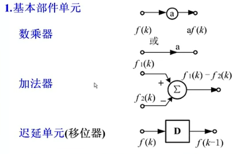
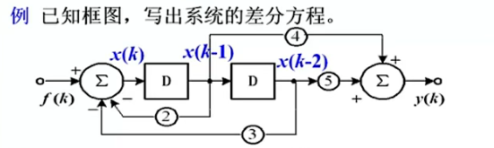
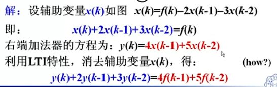
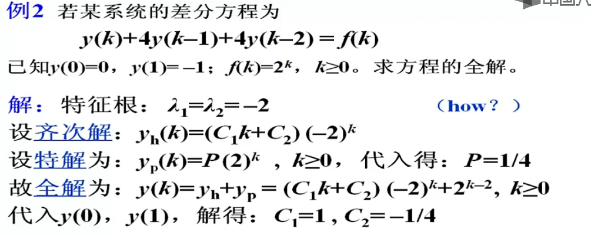

### 3. 离散系统的时域分析

- 离散系统如何描述？求解
- 基本信号与响应是什么？
- 任意信号的分解?
- 离散系统与连续系统的类比关系？

#### 3.1  差分方程的建立及经典解法

##### 3.1.1 差分的定义

- 移位序列：设有序列 $f(k)$ ，则...， $f(k+2)$ ， $f(k+1)$ ， $f(k-1)$ ， $f(k-2)$ ，... 等称为 $f(k)$ 的移位序列。
- 差分运算：

$$
\frac{ \bigtriangleup f(k)}{\bigtriangleup k}
=\frac{f(k+1)-f(k)}{(k+1)-k}
\quad
\frac{ \bigtriangledown f(k)}{\bigtriangledown k}
=\frac{f(k)-f(k-1)}{k-(k-1)}
$$

- 一阶前向差分定义：$\bigtriangleup f(k) = f(k+1)-f(k)$
- 一阶后向差分定义：$\bigtriangledown f(k) = f(k)-f(k-1)$
- 我们主要用 **后向差分** ，简称 **差分**

##### 3.1.2 差分的性质

- 差分的线性性质：$\bigtriangledown[af_1(k)+bf_2(k)] = a\bigtriangledown f_1(k)+b\bigtriangledown f_2(k)$ 
- 二阶差分定义：

$$
\bigtriangledown^2f(k) = \bigtriangledown[\bigtriangledown f(k)] 
= \bigtriangledown f(k)-\bigtriangledown f(k-1)
\\=f(k)-f(k-1)-[f(k-1)-f(k-2)]
\\=f(k)-2f(k-1)+f(k-2)
$$

- m阶差分：

$$
\bigtriangledown^mf(k) =f(k)+b_1f(k-1)+b_2f(k-2)+...+b_mf(k-m)
$$

##### 3.1.3 差分方程的一般形式

$$
y(k) + a_{n-1}y(k-1) + ... + a_0k(k-n) = b_mf(k) + ... + b_0f(k-m)
$$

 - **方程的阶数**：未知变量最高序列号与最低序号的差

 - 由 n 阶差分方程描述的系统称为 **n阶系统**

 - 描述LTI离散系统的是**线性常系数差分方程**

##### 3.1.4 差分方程框图

1. 基本部件：

	2. 例题：

##### 3.1.5 差分方程的经典解法

1. 递推迭代：差分方程本质上是**递推的迭代方程**，若已知初始条件和激励，**利用迭代法**可求得其数值解。（代入数值递推）

2. y经典法：对于经典的差分方程形式如下

$$
y(k) + a_{n-1}y(k-1) + ... + a_0y(k-n) = b_mf(k) + ... + b_0f(k-m)
$$

与连续系统的微分方程经典解类似，差分方程由 **齐次解**  $y_h(k)$ 和**特解** $y_p(k)$ 两部分组成，即：
$$
y(k) = y_h(k) + y_p(k)
$$

- **齐次解**  $y_h(k)$ 是对应齐次差分方程的解：

$$
y(k) + a_{n-1}y(k-1) + ... + a_0k(k-n) = 0
$$

**特征根**为：
$$
1 + a_{n-1}\lambda^{-1} + ... + a_{0}\lambda^{-n} = 0
$$
的根：$\lambda_i (i = 1,2,...,n)$

由特征根可以设定齐次解的函数形式：

|               特征根$\lambda$                |              齐次解$y_h(k)$              |
| :------------------------------------------: | :--------------------------------------: |
|                    单实根                    |               $C\lambda^k$               |
|                   二重实根                   |        $(C_1k + C_0)\lambda ^k $         |
| 共轭复根 $\lambda_{1,2}= \alpha \pm j\beta $ | $[C\cos(\beta k) + D\sin(\beta k)]p^{k}$ |

- **特解**的函数形式与激励的函数形式有关

|                激励$f(t)$                |                         特解$y_p(t)$                         |
| :--------------------------------------: | :----------------------------------------------------------: |
|                  $k^m$                   | $P_mk^m + P_{m-1}k^{m-1} + ... + P_1k + P_0  \quad 所有特征根均不等于1 \\ k \cdot(P_1k + P_0) \quad 有1个等于1的特征根 $ |
|                $\alpha^k$                | $ P\alpha^{k} \quad \alpha 不等于特征根 \\  (P_1k+P_0 )\alpha^{k} \quad \alpha 等于特征根$ |
| $\cos{(\beta k)} \ or \ \sin{(\beta k)}$ | $P \cos(\beta k) + Q\sin(\beta k) \quad 所有的特征根均不低于 \pm j \beta$ |

例题：

##### 3.1.6 零输入响应

##### 3.1.7 零状态响应

